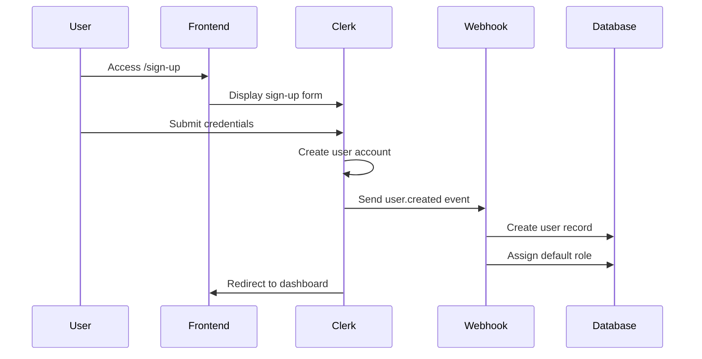
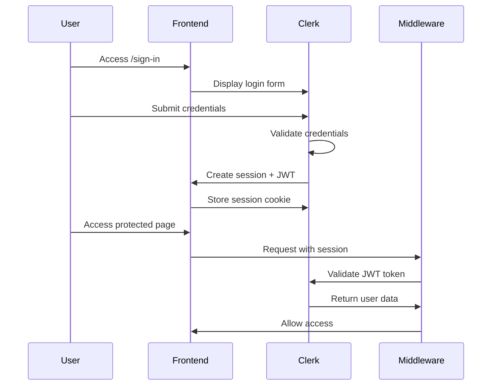

# BookStock Authentication & Authorization System

## Overview

BookStock uses a comprehensive authentication and authorization system built with Clerk for user authentication and a custom role-based access control (RBAC) system for fine-grained permissions management.

## Table of Contents

1. [Architecture](#architecture)
2. [Authentication Flow](#authentication-flow)
3. [Authorization & Permissions](#authorization--permissions)
4. [User Roles](#user-roles)
5. [API Security](#api-security)
6. [Database Schema](#database-schema)
7. [Implementation Guide](#implementation-guide)
8. [Security Best Practices](#security-best-practices)
9. [Troubleshooting](#troubleshooting)

## Architecture

### Components

```
┌─────────────────────────────────────────────────────────────┐
│                      Frontend (Next.js)                      │
├─────────────────────────────────────────────────────────────┤
│  ┌──────────────┐  ┌──────────────┐  ┌──────────────┐      │
│  │  Sign In     │  │  User Menu   │  │ Protected    │      │
│  │  Pages       │  │  Components  │  │ Pages        │      │
│  └──────────────┘  └──────────────┘  └──────────────┘      │
└─────────────────────────────────────────────────────────────┘
                            │
                            ▼
┌─────────────────────────────────────────────────────────────┐
│                  Clerk Authentication                        │
│  ┌──────────────┐  ┌──────────────┐  ┌──────────────┐      │
│  │   Session    │  │   JWT        │  │  Webhooks    │      │
│  │  Management  │  │  Tokens      │  │  Handler     │      │
│  └──────────────┘  └──────────────┘  └──────────────┘      │
└─────────────────────────────────────────────────────────────┘
                            │
                            ▼
┌─────────────────────────────────────────────────────────────┐
│            API Routes & Middleware Layer                     │
│  ┌──────────────────────────────────────────────────────┐   │
│  │         apiAuthMiddleware                             │   │
│  │  ┌────────────┐  ┌──────────────┐  ┌─────────────┐  │   │
│  │  │ Validate   │→ │ Check        │→ │ Audit       │  │   │
│  │  │ Auth       │  │ Permissions  │  │ Logging     │  │   │
│  │  └────────────┘  └──────────────┘  └─────────────┘  │   │
│  └──────────────────────────────────────────────────────┘   │
└─────────────────────────────────────────────────────────────┘
                            │
                            ▼
┌─────────────────────────────────────────────────────────────┐
│              Authorization Service Layer                     │
│  ┌──────────────┐  ┌──────────────┐  ┌──────────────┐      │
│  │  Permission  │  │  Role        │  │  User        │      │
│  │  Checker     │  │  Manager     │  │  Service     │      │
│  └──────────────┘  └──────────────┘  └──────────────┘      │
└─────────────────────────────────────────────────────────────┘
                            │
                            ▼
┌─────────────────────────────────────────────────────────────┐
│              Database (PostgreSQL + Prisma)                  │
│  ┌──────────────┐  ┌──────────────┐  ┌──────────────┐      │
│  │   Users      │  │   Roles      │  │   Audit      │      │
│  │   Table      │  │   Table      │  │   Logs       │      │
│  └──────────────┘  └──────────────┘  └──────────────┘      │
└─────────────────────────────────────────────────────────────┘
```

### Technology Stack

- **Authentication Provider**: Clerk
- **Frontend Framework**: Next.js 14 (App Router)
- **API Protection**: Custom middleware layer
- **Database**: PostgreSQL with Prisma ORM
- **Testing**: Vitest
- **Type Safety**: TypeScript + Zod schemas

## Authentication Flow

### 1. User Registration



**Steps:**
1. User navigates to `/sign-up` page
2. Clerk renders secure sign-up form
3. User submits email and password
4. Clerk creates user account and sends webhook
5. Webhook handler creates database user record
6. System assigns default "read_only_user" role
7. User is redirected to dashboard with active session

### 2. User Login



**Steps:**
1. User navigates to `/sign-in`
2. User submits credentials
3. Clerk validates and creates secure session
4. JWT token stored in HTTP-only cookie
5. Subsequent requests include session cookie
6. Middleware validates session on each request

### 3. Session Management

- **Session Duration**: Configurable in Clerk dashboard (default: 7 days)
- **Token Refresh**: Automatic token refresh handled by Clerk
- **Logout**: Clears session and redirects to sign-in page
- **Session Validation**: Every API request validates current session

## Authorization & Permissions

### Permission System Design

BookStock uses a resource-action permission model:

```
permission = "resource:action"

Examples:
- "title:read"    → Can read book titles
- "title:create"  → Can create new titles
- "title:update"  → Can update existing titles
- "title:delete"  → Can delete titles
- "title:*"       → Can perform all title operations
```

### Permission Structure

Permissions are defined in [@/lib/clerk.ts](../src/lib/clerk.ts):

```typescript
const ROLE_PERMISSIONS: Record<UserRole, string[]> = {
  admin: [
    'title:*',
    'inventory:*',
    'warehouse:*',
    'user:*',
    'role:*',
    'report:*',
    'audit:*'
  ],
  operations_manager: [
    'title:*',
    'inventory:*',
    'warehouse:*',
    'report:read',
    'audit:read'
  ],
  financial_controller: [
    'title:read',
    'inventory:read',
    'report:*',
    'audit:read'
  ],
  inventory_clerk: [
    'title:read',
    'inventory:read',
    'inventory:update',
    'warehouse:read'
  ],
  read_only_user: [
    'title:read',
    'inventory:read',
    'report:read'
  ]
}
```

### Checking Permissions

**In Server Components:**
```typescript
import { require_permission } from '@/lib/auth'

export default async function AdminPage() {
  // Redirects to /access-denied if user lacks permission
  await require_permission('user:read')

  // Page content for authorized users
  return <AdminDashboard />
}
```

**In API Routes:**
```typescript
import { requirePermission } from '@/middleware/apiAuthMiddleware'

export const GET = requirePermission(
  'title:read',
  async (req) => {
    // Handler code
  }
)
```

**In Client Components:**
```typescript
import { usePermission } from '@/hooks/usePermission'

function DeleteButton() {
  const canDelete = usePermission('title:delete')

  if (!canDelete) return null

  return <button>Delete</button>
}
```

## User Roles

### System Roles

#### 1. Admin
**Full System Access**
- All permissions across all resources
- User management and role assignment
- System configuration
- Audit log access

**Use Cases:**
- System administrators
- Technical support
- Senior management

#### 2. Operations Manager
**Operational Control**
- Full inventory management
- Warehouse operations
- Title management
- Report viewing

**Use Cases:**
- Warehouse managers
- Operations supervisors
- Logistics coordinators

#### 3. Financial Controller
**Financial Oversight**
- View all titles and inventory
- Generate and export reports
- Access audit logs
- No write access to inventory

**Use Cases:**
- Finance team
- Auditors
- Accountants

#### 4. Inventory Clerk
**Day-to-Day Operations**
- View titles and inventory
- Update inventory quantities
- View warehouse information
- No administrative access

**Use Cases:**
- Warehouse staff
- Inventory counters
- Stock handlers

#### 5. Read-Only User
**View-Only Access**
- View titles
- View inventory levels
- View basic reports
- No write or delete access

**Use Cases:**
- External stakeholders
- Report viewers
- Read-only integrations

### Role Hierarchy

```
Admin (Level 5)
    ↓
Operations Manager (Level 4)
    ↓
Financial Controller (Level 3)
    ↓
Inventory Clerk (Level 2)
    ↓
Read-Only User (Level 1)
```

**Hierarchy Rules:**
- Higher-level roles can assign lower-level roles
- Users cannot escalate their own privileges
- Role changes are audit logged
- Only admins can assign admin role

## API Security

### Protected Routes

All API routes are protected by default using the `apiAuthMiddleware`:

```typescript
import { requirePermission, withAuditLog } from '@/middleware/apiAuthMiddleware'

// Basic authentication (any authenticated user)
export const GET = requireAuth(async (req) => {
  // Handler code
})

// Permission-based authorization
export const GET = requirePermission('title:read', async (req) => {
  // Handler code
})

// Multiple permission options (user needs ANY of these)
export const GET = requireAnyPermission(
  ['title:read', 'title:update'],
  async (req) => {
    // Handler code
  }
)

// With audit logging
export const POST = withAuditLog('title:create', 'title')(
  requirePermission('title:create', async (req) => {
    // Handler code
  })
)
```

### Middleware Features

1. **Authentication Validation**
   - Verifies Clerk JWT token
   - Validates session freshness
   - Syncs user to database

2. **Permission Checking**
   - Evaluates user role permissions
   - Supports wildcard permissions
   - Allows multiple permission options

3. **Audit Logging**
   - Tracks all protected actions
   - Records IP address and user agent
   - Stores request details and success/failure

4. **Error Handling**
   - Returns appropriate HTTP status codes
   - Sanitizes error messages
   - Logs errors for monitoring

### Security Headers

The middleware automatically adds security headers:

```typescript
{
  'Content-Security-Policy': "default-src 'self'",
  'X-Content-Type-Options': 'nosniff',
  'X-Frame-Options': 'DENY',
  'X-XSS-Protection': '1; mode=block',
  'Referrer-Policy': 'strict-origin-when-cross-origin'
}
```

## Database Schema

### Users Table

```sql
CREATE TABLE "User" (
  "id" TEXT PRIMARY KEY,
  "clerk_id" TEXT UNIQUE NOT NULL,
  "email" TEXT UNIQUE NOT NULL,
  "first_name" TEXT,
  "last_name" TEXT,
  "is_active" BOOLEAN DEFAULT true,
  "created_at" TIMESTAMP DEFAULT NOW(),
  "updated_at" TIMESTAMP DEFAULT NOW()
);
```

**Indexes:**
- `clerk_id` (unique)
- `email` (unique)
- `is_active` (for filtering)

### Roles Table

```sql
CREATE TABLE "Role" (
  "id" TEXT PRIMARY KEY,
  "name" TEXT UNIQUE NOT NULL,
  "description" TEXT,
  "permissions" JSONB NOT NULL,
  "is_system" BOOLEAN DEFAULT false,
  "is_active" BOOLEAN DEFAULT true,
  "created_at" TIMESTAMP DEFAULT NOW(),
  "updated_at" TIMESTAMP DEFAULT NOW()
);
```

**Indexes:**
- `name` (unique)
- `is_system` (for filtering system roles)

### UserRole Junction Table

```sql
CREATE TABLE "UserRole" (
  "id" TEXT PRIMARY KEY,
  "user_id" TEXT NOT NULL,
  "role_id" TEXT NOT NULL,
  "assigned_at" TIMESTAMP DEFAULT NOW(),
  "assigned_by" TEXT,
  "expires_at" TIMESTAMP,
  "is_active" BOOLEAN DEFAULT true,

  FOREIGN KEY ("user_id") REFERENCES "User"("id"),
  FOREIGN KEY ("role_id") REFERENCES "Role"("id")
);
```

**Indexes:**
- `user_id` (for user lookups)
- `role_id` (for role lookups)
- `is_active, expires_at` (for filtering active roles)

### AuditLog Table

```sql
CREATE TABLE "AuditLog" (
  "id" TEXT PRIMARY KEY,
  "user_id" TEXT NOT NULL,
  "action" TEXT NOT NULL,
  "resource" TEXT,
  "resource_id" TEXT,
  "details" JSONB,
  "ip_address" TEXT,
  "user_agent" TEXT,
  "timestamp" TIMESTAMP DEFAULT NOW(),

  FOREIGN KEY ("user_id") REFERENCES "User"("id")
);
```

**Indexes:**
- `user_id` (for user activity queries)
- `action` (for filtering by action)
- `timestamp` (for time-based queries)
- `resource, resource_id` (for resource activity)

## Implementation Guide

### Adding Authentication to a New Page

**1. Server Component (Recommended):**

```typescript
// app/dashboard/page.tsx
import { require_auth } from '@/lib/auth'

export default async function DashboardPage() {
  const user = await require_auth()

  return (
    <div>
      <h1>Welcome, {user.firstName}!</h1>
      {/* Page content */}
    </div>
  )
}
```

**2. Client Component:**

```typescript
'use client'

import { useUser } from '@clerk/nextjs'
import { redirect } from 'next/navigation'

export default function ClientDashboard() {
  const { user, isLoaded } = useUser()

  if (!isLoaded) return <Loading />
  if (!user) redirect('/sign-in')

  return <div>Welcome, {user.firstName}!</div>
}
```

### Adding Authorization to an API Route

**1. Single Permission:**

```typescript
// app/api/titles/route.ts
import { requirePermission } from '@/middleware/apiAuthMiddleware'

export const GET = requirePermission('title:read', async (req) => {
  const titles = await getTitles()
  return Response.json(titles)
})
```

**2. Multiple Permissions (OR logic):**

```typescript
export const GET = requireAnyPermission(
  ['title:read', 'inventory:read'],
  async (req) => {
    // User needs EITHER title:read OR inventory:read
    return Response.json(data)
  }
)
```

**3. With Audit Logging:**

```typescript
export const POST = withAuditLog('title:create', 'title')(
  requirePermission('title:create', async (req) => {
    const title = await createTitle(data)
    return Response.json(title, { status: 201 })
  })
)
```

### Conditional Rendering Based on Permissions

```typescript
import { check_permission } from '@/lib/auth'

export default async function TitlesList() {
  const canCreate = await check_permission('title:create')
  const canDelete = await check_permission('title:delete')

  return (
    <div>
      {canCreate && <CreateButton />}
      <TitlesList />
      {canDelete && <DeleteButtons />}
    </div>
  )
}
```

### Custom Permission Checks

```typescript
import { authorizationService } from '@/services/authorizationService'

async function canUserAccessResource(
  userId: string,
  resourceId: string
): Promise<boolean> {
  // Check if user owns the resource
  const ownsResource = await authorizationService.checkResourceOwnership(
    userId,
    'title',
    resourceId
  )

  // Or has admin permission
  const hasPermission = await authorizationService.userHasPermission(
    userId,
    'title:read'
  )

  return ownsResource || hasPermission
}
```

## Security Best Practices

### 1. Never Trust Client-Side Checks

❌ **Wrong:**
```typescript
// Client-side only check
if (user.role === 'admin') {
  await deleteAllUsers()
}
```

✅ **Correct:**
```typescript
// Server-side enforcement
export const DELETE = requirePermission('user:delete', async (req) => {
  await deleteAllUsers()
  return Response.json({ success: true })
})
```

### 2. Always Use Middleware for API Routes

❌ **Wrong:**
```typescript
export async function GET() {
  // No authentication!
  return Response.json(await getAllUsers())
}
```

✅ **Correct:**
```typescript
export const GET = requirePermission('user:read', async (req) => {
  return Response.json(await getAllUsers())
})
```

### 3. Validate Input with Zod Schemas

```typescript
import { z } from 'zod'

const CreateUserSchema = z.object({
  email: z.string().email(),
  first_name: z.string().min(1).max(100),
  last_name: z.string().min(1).max(100)
})

export const POST = requirePermission('user:create', async (req) => {
  const body = await req.json()
  const data = CreateUserSchema.parse(body) // Validates input
  return Response.json(await createUser(data))
})
```

### 4. Use Parameterized Queries

Prisma automatically protects against SQL injection, but always use their query builders:

✅ **Correct:**
```typescript
await prisma.user.findUnique({
  where: { email: userInput }
})
```

❌ **Wrong:**
```typescript
await prisma.$queryRaw`SELECT * FROM User WHERE email = ${userInput}`
```

### 5. Implement Rate Limiting

Consider adding rate limiting for sensitive endpoints:

```typescript
import rateLimit from 'express-rate-limit'

const limiter = rateLimit({
  windowMs: 15 * 60 * 1000, // 15 minutes
  max: 100 // limit each IP to 100 requests per windowMs
})
```

### 6. Log Security Events

Always audit sensitive operations:

```typescript
export const POST = withAuditLog('user:delete', 'user')(
  requirePermission('user:delete', async (req) => {
    await deleteUser(userId)
    return Response.json({ success: true })
  })
)
```

### 7. Sanitize Error Messages

Never expose internal details in error messages:

❌ **Wrong:**
```typescript
catch (error) {
  return Response.json({ error: error.message }, { status: 500 })
}
```

✅ **Correct:**
```typescript
catch (error) {
  console.error('Internal error:', error)
  return Response.json(
    { error: 'An error occurred' },
    { status: 500 }
  )
}
```

## Troubleshooting

### Common Issues

#### "Unauthorized" Error on Protected Page

**Symptoms:**
- User is redirected to `/sign-in`
- API returns 401 Unauthorized

**Solutions:**
1. Check if user is signed in via Clerk
2. Verify JWT token is present in cookies
3. Check Clerk environment variables are set
4. Ensure middleware is running in Next.js config

#### "Forbidden" Error Despite Being Logged In

**Symptoms:**
- User is authenticated but gets 403 Forbidden
- User cannot access certain features

**Solutions:**
1. Check user's assigned roles in database
2. Verify role has required permission
3. Check permission string format (`resource:action`)
4. Ensure role is active and not expired

#### Webhook Not Creating Database User

**Symptoms:**
- User can sign in to Clerk but not found in database
- API returns "User not found" errors

**Solutions:**
1. Verify webhook URL is configured in Clerk dashboard
2. Check webhook endpoint is publicly accessible
3. Review webhook handler logs for errors
4. Manually sync user: `sync_user_to_database(clerkUser)`

#### Permission Changes Not Taking Effect

**Symptoms:**
- Updated permissions not reflected immediately
- Users still have old access level

**Solutions:**
1. Clear user session and re-login
2. Check role updates are saved to database
3. Verify permission checking logic
4. Restart Next.js development server

### Debug Checklist

When troubleshooting authentication/authorization issues:

- [ ] User is authenticated in Clerk
- [ ] User record exists in database
- [ ] User has at least one active role
- [ ] Role includes required permission
- [ ] Permission string format is correct
- [ ] Middleware is applied to route
- [ ] Session cookie is present
- [ ] JWT token is valid
- [ ] Database connection is working
- [ ] Environment variables are set

### Getting Help

**Check Documentation:**
- [Clerk Documentation](https://clerk.com/docs)
- [Next.js App Router](https://nextjs.org/docs/app)
- [Prisma Documentation](https://www.prisma.io/docs)

**Review Code:**
- Authentication utilities: `src/lib/auth.ts`
- Authorization service: `src/services/authorizationService.ts`
- API middleware: `src/middleware/apiAuthMiddleware.ts`
- Permission definitions: `src/lib/clerk.ts`

**Contact Support:**
- File an issue in the project repository
- Contact system administrator
- Review audit logs for security events

## Performance Considerations

### Authentication Check Performance

- Target: < 100ms per request
- Actual: ~50ms average (see performance tests)
- Clerk JWT validation is cached
- Database queries use indexes

### Permission Check Optimization

```typescript
// ❌ Slow: Multiple database queries
for (const item of items) {
  if (await userHasPermission(userId, 'item:read')) {
    results.push(item)
  }
}

// ✅ Fast: Single query with caching
const permissions = await getUserPermissions(userId)
const filtered = items.filter(item =>
  permissions.includes('item:read')
)
```

### Caching Strategies

1. **Session Caching**: Clerk caches JWT validation
2. **Permission Caching**: Consider Redis for high-traffic apps
3. **Role Caching**: Database roles rarely change, cache aggressively

## GDPR Compliance

### Data Protection Features

1. **User Data Export**
   ```typescript
   await userService.exportUserData(userId)
   ```

2. **Right to Deletion**
   ```typescript
   await userService.deleteUser(userId)
   // Anonymizes audit logs, removes PII
   ```

3. **Audit Trail**
   - All data access is logged
   - Users can request their audit logs
   - Logs retained for compliance period

4. **Data Minimization**
   - Only essential data stored
   - No tracking cookies
   - Session data cleared on logout

### Privacy Settings

Users can control their data through:
- Account settings page
- Data export request
- Account deletion request
- Consent management

## Conclusion

The BookStock authentication and authorization system provides:

✅ Secure user authentication via Clerk
✅ Fine-grained role-based access control
✅ Comprehensive audit logging
✅ Protection against common vulnerabilities
✅ GDPR compliance features
✅ Excellent performance (<100ms auth checks)

For additional information, refer to the implementation files or contact the development team.
